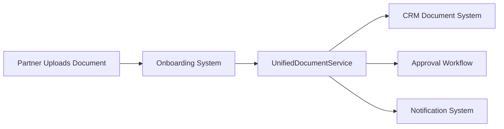

# 🔄 Unified Document Management System

## Overview

The **Unified Document Management System** seamlessly integrates partner onboarding and CRM document management, ensuring that **everything happening in the onboarding part is automatically linked to the CRM**. This eliminates data silos and provides a complete view of partner documents across the entire lifecycle.

## 🎯 Key Features

### ✅ **Automatic Synchronization**
- **Real-time sync**: Documents uploaded during onboarding are automatically added to CRM
- **Metadata enrichment**: Partner information, stage context, and business details are preserved
- **Approval workflows**: Appropriate approval processes are automatically attached based on document type

### ✅ **Unified Document Lifecycle**
- **Single source of truth**: All partner documents accessible from both onboarding and CRM interfaces
- **Complete audit trail**: Track document journey from onboarding through CRM management
- **Consistent permissions**: Role-based access control across both systems

### ✅ **Enhanced User Experience**
- **Visual notifications**: Users see confirmation when documents sync to CRM
- **Seamless workflow**: No manual re-uploading or data entry required
- **Professional interface**: Modern UI with GSAP animations and responsive design

## 🏗️ System Architecture

### Core Components

#### 1. **UnifiedDocumentService** (`src/services/unifiedDocumentService.ts`)
```typescript
class UnifiedDocumentService {
  // Main sync method
  async syncOnboardingDocumentToCRM(
    file: File,
    documentType: 'nda' | 'kyc' | 'agreement' | 'commercial' | 'other',
    partnerInfo: PartnerInfo,
    stageId?: string,
    documentId?: string
  ): Promise<Document | null>

  // Helper methods
  private createUnifiedDocumentMetadata()
  private addToCRMSystem()
  private attachApprovalWorkflow()
  private triggerDocumentNotifications()
}
```

#### 2. **Enhanced Onboarding Components**
- **PartnerOnboardingChat**: Updated with unified document sync
- **DocumentUploadSection**: KYC documents automatically sync to CRM
- **DocumentUpload**: Standalone upload component with CRM integration
- **UnifiedDocumentNotification**: Visual feedback for successful syncs

#### 3. **CRM Document Management**
- **DocumentsPage**: View all documents including onboarding uploads
- **Advanced search**: Find documents by partner, stage, or document type
- **Approval workflows**: Process documents uploaded during onboarding

## 🔄 Document Flow

### 1. **Onboarding Upload**


### 2. **Document Metadata Mapping**
| Onboarding Field | CRM Document Field | Description |
|------------------|-------------------|-------------|
| `file.name` | `name` | Enhanced with partner company and date |
| `partnerInfo.organization` | `customFields.partnerCompany` | Company name |
| `partnerInfo.name` | `uploadedBy` | Contact person |
| `stageId` | `customFields.onboardingStage` | Which stage document was uploaded |
| `documentType` | `type` + `category` | Mapped to appropriate CRM types |

### 3. **Automatic Workflow Assignment**
- **NDA documents** → `NDA Quick Approval` workflow
- **KYC documents** → `Partnership Agreement Approval` workflow
- **Contracts** → `Partnership Agreement Approval` workflow
- **Other documents** → No workflow (draft status)

## 📋 Document Types & Categories

### Type Mapping
```typescript
const typeMapping = {
  nda: {
    type: 'nda',
    category: 'legal',
    status: 'pending_review',
    workflowType: 'NDA Quick Approval'
  },
  kyc: {
    type: 'other',
    category: 'compliance',
    status: 'pending_review',
    workflowType: 'Partnership Agreement Approval'
  },
  agreement: {
    type: 'contract',
    category: 'partnership',
    status: 'pending_review',
    workflowType: 'Partnership Agreement Approval'
  },
  commercial: {
    type: 'proposal',
    category: 'financial',
    status: 'pending_review'
  }
};
```

### Enhanced Document Names
- **NDA**: `NDA - [Company] - [Date]`
- **KYC**: `KYC - [Company] - [Original Filename]`
- **Agreement**: `Partnership Agreement - [Company] - [Date]`
- **Commercial**: `Commercial Terms - [Company] - [Date]`

## 🏷️ Tagging System

### Automatic Tags
- **Document type**: `nda`, `kyc`, `agreement`, `commercial`
- **Source**: `onboarding`, `partner`, `auto-synced`
- **Company**: `[company-name]` (normalized)
- **Stage**: `stage-[stageId]`
- **Document ID**: `doc-[documentId]`
- **Workflow tags**: `legal-review`, `compliance-review`, `high-priority`

### Search & Filter Benefits
```typescript
// Find all NDA documents from onboarding
tags: ['nda', 'onboarding']

// Find all documents for specific partner
customFields.partnerCompany: 'Acme Corp'

// Find documents from specific onboarding stage
tags: ['stage-kyc']
```

## 🔔 Notification System

### Real-time Notifications
- **Document uploaded**: Notify relevant teams when documents are synced
- **Approval required**: Alert approvers when workflows are triggered
- **Visual feedback**: Show users confirmation of successful sync

### Notification Data
```typescript
{
  type: 'document_uploaded',
  title: 'New NDA Document Uploaded',
  message: 'Acme Corp has uploaded a nda document: NDA - Acme Corp - 2024-01-15',
  documentId: 'unified-1234567890-abc123',
  partnerInfo: { /* partner details */ },
  requiresApproval: true
}
```

## 🔍 Search & Discovery

### Enhanced Search Capabilities
- **Full-text search**: Find documents by content, partner name, or description
- **Faceted filtering**: Filter by type, category, status, tags
- **Partner-specific views**: See all documents for a specific partner
- **Stage-based filtering**: Find documents from specific onboarding stages

### Search Examples
```typescript
// Find all documents for a partner
await documentService.searchDocuments({
  query: 'acme-corp',
  tags: ['partner']
});

// Find pending NDA approvals
await documentService.searchDocuments({
  type: ['nda'],
  status: ['pending_review']
});

// Find KYC documents needing compliance review
await documentService.searchDocuments({
  category: ['compliance'],
  tags: ['kyc-required']
});
```

## 🔐 Security & Compliance

### Access Control
- **Role-based permissions**: Consistent across onboarding and CRM
- **Audit logging**: Complete access history for compliance
- **Encryption support**: Document encryption capabilities
- **Retention policies**: Automatic document lifecycle management

### Compliance Features
- **Version history**: Track all document changes
- **Digital signatures**: Support for approval workflows
- **Access logs**: Who accessed what and when
- **Retention policies**: Automatic archival and deletion

## 🚀 Implementation Guide

### 1. **Setup**
```bash
# Install dependencies (already included)
npm install

# Build the project
npm run build

# Run development server
npm run dev
```

### 2. **Testing the Integration**
1. **Start onboarding flow**: Go to partner onboarding
2. **Upload NDA**: Use the file upload in NDA stage
3. **Check CRM**: Navigate to CRM → Documents
4. **Verify sync**: Document should appear with proper metadata
5. **Test notifications**: Watch for sync confirmation

### 3. **Customization**
```typescript
// Extend document types
type CustomDocumentType = 'nda' | 'kyc' | 'agreement' | 'commercial' | 'custom';

// Add custom metadata
customFields: {
  source: 'partner_onboarding',
  customField1: 'value1',
  customField2: 'value2'
}

// Custom approval workflows
await unifiedDocumentService.attachCustomWorkflow(document, workflowId);
```

## 📊 Analytics & Reporting

### Document Metrics
- **Upload volume**: Track documents uploaded per stage
- **Processing time**: Monitor approval workflow duration
- **Partner activity**: See document activity by partner
- **Compliance status**: Track KYC completion rates

### Available Reports
- **Partner document summary**: All documents for each partner
- **Approval bottlenecks**: Identify workflow delays
- **Upload trends**: Document volume over time
- **Compliance dashboard**: KYC and regulatory document status

## 🔧 Troubleshooting

### Common Issues

#### **Documents not syncing**
```typescript
// Check console for errors
console.log('🔄 Syncing onboarding document to CRM:', {
  fileName: file.name,
  documentType,
  partnerCompany: partnerInfo.organization,
  stageId
});
```

#### **Missing partner information**
```typescript
// Ensure partner info is available
if (!state?.partnerInfo) {
  console.error('Partner info not available for document sync');
  return;
}
```

#### **Workflow not attached**
```typescript
// Check workflow availability
const workflows = await documentService.getWorkflows();
console.log('Available workflows:', workflows.map(w => w.name));
```

### Debug Mode
```typescript
// Enable detailed logging
localStorage.setItem('unified-document-debug', 'true');

// Check sync status
const documents = await unifiedDocumentService.getPartnerDocuments(partnerEmail);
console.log('Partner documents:', documents);
```

## 🎯 Benefits

### For Partners
- **Seamless experience**: Upload once, available everywhere
- **Visual feedback**: Clear confirmation of successful uploads
- **No duplicate work**: Documents automatically flow to CRM

### For Internal Teams
- **Complete visibility**: All partner documents in one place
- **Automated workflows**: Approval processes start automatically
- **Better organization**: Consistent tagging and categorization

### For Administrators
- **Unified management**: Single system for all document operations
- **Audit compliance**: Complete document lifecycle tracking
- **Scalable architecture**: Easy to extend and customize

## 🔮 Future Enhancements

### Planned Features
- **Document versioning**: Track changes across onboarding and CRM
- **Advanced OCR**: Extract data from uploaded documents
- **Integration APIs**: Connect with external document systems
- **Mobile optimization**: Enhanced mobile upload experience
- **Bulk operations**: Process multiple documents simultaneously

### Extensibility
- **Custom document types**: Add new document categories
- **Workflow builder**: Create custom approval processes
- **Integration hooks**: Connect with external systems
- **Advanced analytics**: Custom reporting and dashboards

---

## 📞 Support

For questions or issues with the unified document system:

1. **Check the console**: Look for sync confirmation messages
2. **Verify permissions**: Ensure proper role-based access
3. **Test workflow**: Upload a test document and track its journey
4. **Review logs**: Check document access logs for troubleshooting

The unified document system ensures that **everything happening in the onboarding part is automatically linked to the CRM**, providing a seamless, professional experience for partners and internal teams alike. 